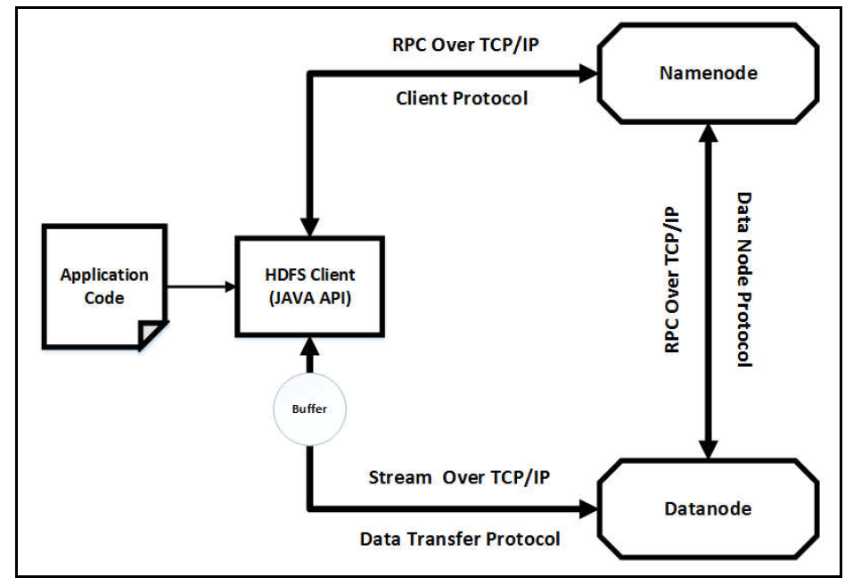

# Chapter 2
하둡 HDFS에 대해 자세히 알아보자

## HDFS의 특징  

1. 내결함성
2. 실시간 데이터 접근
3. 확장성
4. 간단함
5. 고가용성

하둡 플랫폼은 **분산 저장소**와 **분산 처리**, 두개의 논리적 구성으로 되어있다.  
_HDFS_ 가 **분산 저장**소 를, _MapReduce와 YARN-호환 프레임워크들_ 이 **분산 처리** 능력을 제공한다.  

## HDFS logical architecture

이 아키텍쳐는 간단하게 **데이터 그룹**과 **관리 그룹**, 두가지 그룹으로 나눌 수 있다.  
**데이터 그룹**은 파일 저장소의 처리/구성요소를 포함하고   
**관리 그룹**은 데이터 오퍼레이션(읽기,쓰기,자르기,삭제)을 관리하는 처리/구성요소를 포함한다.  
 
데이터 그룹: Data blocks, replication, checkpoints, file metadata  
관리 그룹: NameNodes, DataNodes, JournalNodes, Zookeepers  
 

### 관리 그룹(Management group)의 구성요소

- **NameNode**: HDFS는 마스터-슬레이브 구조이고 네임노드는 마스터의 역할을 한다. 네임노드는 데이터의 메타데이터를 관리하는데 File System namespace, fsimage files, edit logs files 이렇게 세가지의 정보를 저장한다.  
fsimage는 파일 시스템의 한 시점의 상태를 저장  
edit log는 fsimage가 저장된 이후의 HDFS의 모든 파일의 변화를 저장.  
fsimage와 edit log를 병합하는것을 체크포인팅이라고 한다.

- **DataNode**: HDFS의 구조에서 슬레이브 역할을 한다. 네임노드나 HDFS 클라이언트로부터 받은 data block operation을 수행(생성, 수정, 삭제)  
processing job은 MapReduce등을 이용하고 block의 정보를 네임노드에 다시 전달한다. 또한 복제가 있는 데이터 노드끼리 통신 할 수 있다.  

- **JournalNode**: 저널노드는 활성된 네임노드와 대기중인 네임노드 사이에서 edit log와 HDFS 메타데이터를 관리하는 역할이다.  
쓰기 동시성 제어를 통해 활성된 하나의 네임노드가 edit log를 작성하도록 한다.

- **Zookeeper failover controllers(ZKFC)**: 하둡은 네임노드의 고가용성을 유지하기 위해 두가지 구성요소를 소개한다 **Zookeeper Quorum**과 **ZKFC**이다.  
주키퍼는 네임노드의 health와 connectivity의 정보를 점검하며 네임노드가 만료되면 재시작하는 역할을 수행한다.  
failure이나 crash 이벤트가 발생한다면 만료된 세션은 failed 네임노드에 의해 재시작 되지 못하며 이때 주키퍼가 대기중인 네임노드에 failover 프로세스를 시작한다. 이 주키퍼의 클라이언트가 ZKFC이며 네임노드의 건강을 모니터링하고 세션을 관리하며 쓰기 동시성 제어를 한다.

### 데이터 그룹(Data group)의 개념
데이터 그룹은 **Block**, **Replication** 두개의 개념이 있다.  
1. Block은 HDFS가 한번에 읽거나 쓸수 있는 최소 데이터의 양을 정의한다.  
기본 block의 크기는 64MB나 128MB 이며 이는 Unix-level 파일시스템과 비교 했을 때 더 큰 사이즈다.  
이렇게 큰 블록 사이즈를 사용하는 이유가 여러가지 있는데, **첫번째**로 만약 블록의 사이즈가 너무 작다면 네임노드가 관리해야하는 메타데이터가 많아져 메모리가 모자라는 현상이 발생한다. 큰 사이즈의 블록은 메타데이터를 효과적으로 관리할 수 있다.  
**두번째**로 데이터 블록이 클 경우 Hadoop의 처리량이 증가한다.

2. Replication 

