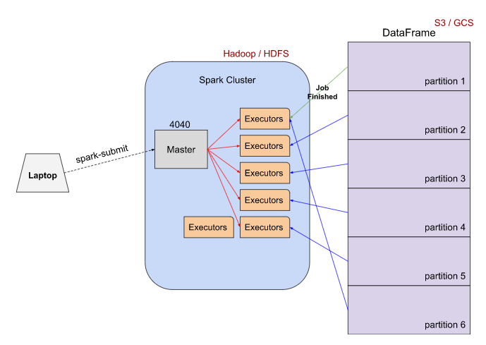
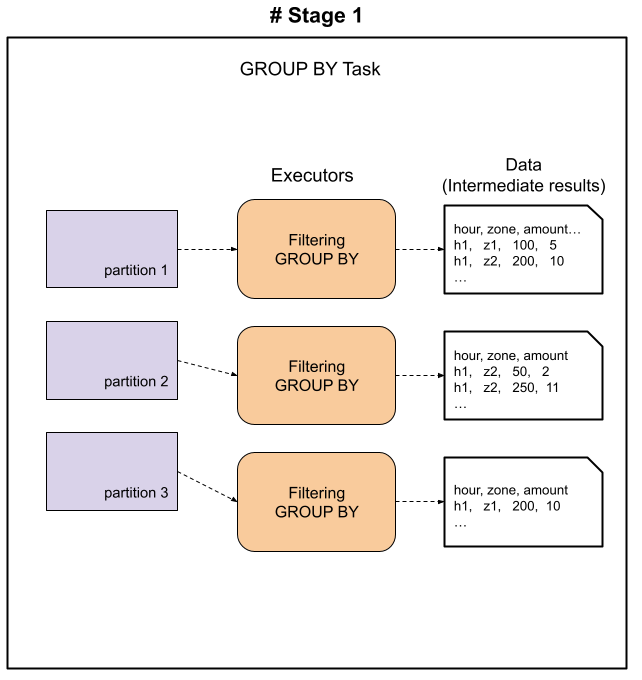
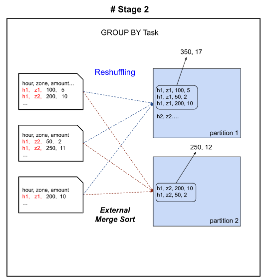

# Apache Spark 
빅데이터 처리를 위한 오픈소스 분산 처리 플랫폼, 빅데이터 분산 처리 엔진.

## 등장 배경

- 하둡과 같은 분산 컴퓨팅에서 기존 디스크 입출력에 대한 시간 지연 발생
    - 반복적인 작업이나 실시간 처리를 위해 빠른 처리 필요
- 하둡의 맵리듀스는 프로그램 처리 단계별로 중간 처리 데이터를 모두 하드디스크에 저장
    - 맵리듀스 잡의 다른 맵리듀스 잡에서 사용하려면 디스크 저장 → HDFS에 저장 과정 필요
    - 복잡한 단계를 가진 단계적 데이터처리에 부적합
- 스파크는 필요한 데이터를 메모리에 캐시로 저장하는 인-메모리 실행 방식 채택
    - 단계별 처리 시 기존 결과를 메모리에 저장하고 메모리에서 불러옴으로써 I/O 시간 단축

## 스파크의 특징

- 대량의 데이터를 메모리에 유지하는 설계로 계산 성능 대폭 강화
    - 스파크 프로그램은 하둡의 맵리듀스보다 약 100개 더 빠른 속도로 동작
- 파이썬, 자바, 스칼라, R 등 기존 타 플랫폼 사용자를 광범위하게 포용
- 일괄 처리, 실시간 처리(스트리밍), 정형데이터 SQL 처리, 그래프 알고리즘, 머신러닝 등 다양한 요구사항 통합
- 하둡을 대체하여 빠른 속도로 성장 중이며 대용량 데이터 처리가 필요한 곳에서 범용적으로 활용
- 온라인 트랜잭션 처리(OLTP)보다 온라인 분석 처리(OLAP)에 더 적합
    - 분산처리를 위한 시간적 오버헤드 발생
    - 아주 작은 데이터를 처리 할 때도 기본적인 준비 과정 보유 → 소규모 데이터는 일반 DBMS가 유리

## RDD(Resilient Distributed Dataset)

RDD는 Spark의 기본 데이터 구조로 내결함성 및 불변성을 지닌 분산 컬렉션이다. RDD의 각 데이터셋은 클러스터의 다른 노드에서 계산할 수 있는 논리적 파티션으로 나뉘어 있다.크게 두 가지 작업을 수행할 수 있다.

1. **Tansformation**: RDD에 Map과 같은 변환 작업을 실시한다. 단 RDD는 변경할 수 없으므로 새로운 RDD를 반환한다.
2. **Action**: RDD에 Reduce와 같은 집계 작업을 수행한다.

RDD를 직역하면 탄력적인 분산 데이터 셋이다. 스파크의 기본 데이터 구조이며 클러스터의 여러 노드에 데이터를 분할 저장 및 병렬로 처리할 수 있다. 주로 데이터 셋에서 로우 레벨의 변환을 수행하려는 경우 사용한다. 특히 RDD는 생성 시 데이터셋의 스키마를 자동으로 유추하지 않기 때문에 직접 지정해주어야 한다. (전처리 부분에서의 제어가 더 필요한 경우 RDD를 사용한다.)

## **Dataframe**

RDD의 한계를 극복하기 위해서 스파크 1.3버전에 처음 도입되었다. 행과 열로 구성되어 있으며 RDD와 다르게 스키마를 자동으로 생성하며 RDD에서는 불가능했던 런타임 중의 디버깅이 가능하다. 더 나아가 csv, json, avro, hdfs 등 다양한 데이터 포맷을 읽고 쓸 수 있다. 최적화를 위해 catalyst optimizer를 사용한다.

## **Dataset**

스파크 데이터셋은 데이터프레임 API의 확장으로 RDD와 데이터프레임의 이점을 모두 제공한다. SQL 엔진을 사용하여 데이터셋의 스키마를 자동으로 찾으며 객체지향과 type-safe 인터페이스를 제공한다. 해당 인터페이스는 컴파일링 중에 데이터 유형을 검사하고 유효하지 않다면 에러를 발생시킨다. 정형 데이터와 비정형 데이터를 모두 효율적으로 처리할 수 있다. 단 Python은 아직까지 스파크 데이터 셋을 생성할 수 없다. Dataset은 RDD보다는 빠르지만 Dataframe보다는 약간 느리다.

## Spark Cluster

 

## Spark Group BY task

  

 